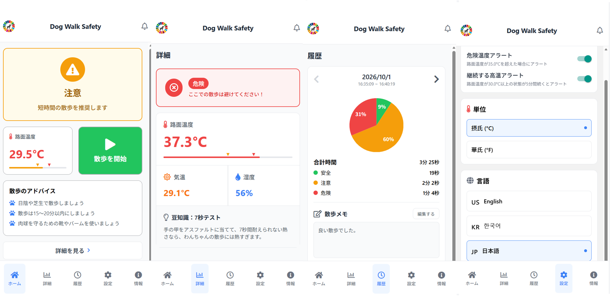
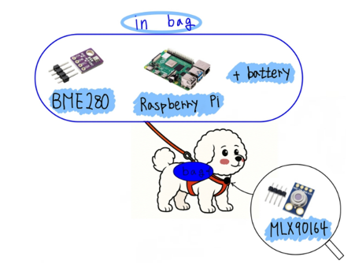

# Dog Walk Safety

**English** | [日本語](README_ja.md)

<p>
  
  
  
  
  
</p>

**Dog Walk Safety** is an IoT-based walking support application designed to help reduce the risk of paw burns caused by hot pavement during pet walks.

This project was developed as part of **[SP!ED 2025](https://ire-asia.org/ire/spied/index.php/spied2025/)** by an international student team.  
My primary responsibility was **frontend development for the mobile application**.

This repository publishes the frontend portion that I worked on as a portfolio project.  
To make the application accessible without physical sensors or a Raspberry Pi, the web demo uses simulated sensor data.

---

## 🌐 Live Demo

**[▶ Try Dog Walk Safety](https://spied2025-dog-walk-safety.vercel.app/)**

The demo is available from both desktop and mobile web browsers.

It simulates road surface temperature, air temperature, and humidity so that the mobile application UI can be experienced without physical hardware.

<p align="center">
  
</p>

---

## 📖 Project Overview

On hot days, asphalt and pavement surfaces can become much hotter than the surrounding air.

Even when the air temperature feels tolerable, pets walking directly on a hot surface may be at risk of paw burns.

To address this problem, we developed **Dog Walk Safety**, a system that uses environmental sensor data such as:

- Road surface temperature
- Air temperature
- Humidity

The application presents the current road condition in three levels:

- **Safe**
- **Caution**
- **Danger**

This provides pet owners with information that can help them decide whether the environment is suitable for a walk.

---

## 💡 Problem We Wanted to Solve

Weather forecasts provide air temperature, but they do not usually show the temperature of the **road surface that a pet's paws directly touch**.

Especially during hot weather:

```text
Air temperature
      ↓
Pavement becomes even hotter
      ↓
Risk of paw burns
```

We therefore designed the following workflow:

```text
Sense the environment
        ↓
Process sensor data
        ↓
Display the information on a smartphone
        ↓
Help the owner assess walking conditions
```

---

## 🏗️ System Architecture

The original SP!ED 2025 prototype combined physical hardware with a mobile application.

<p align="center">
  
</p>

```text
IR Sensor
  └─ Measures road surface temperature

Environment Sensor
  └─ Measures air temperature and humidity

        ↓

Raspberry Pi
  └─ Processes sensor data

        ↓
     Bluetooth
        ↓

Dog Walk Safety
Mobile App
```

### Portfolio Version

For this GitHub portfolio, the application can be experienced without the original hardware.

```text
Simulated Sensor Data
        ↓
Dog Walk Safety
React Native / Expo
        ↓
Expo Web
        ↓
Web Browser
```

Road surface temperature, air temperature, and humidity are simulated for demonstration purposes.

---

## ✨ Main Features

### 🏠 Home

The main dashboard shows the current road condition.

- Road surface temperature
- Safe / Caution / Danger status
- Start and stop a walk
- Walking advice based on the current condition

### 📊 Detail

Displays more detailed environmental information.

- Road surface temperature
- Air temperature
- Humidity
- 7-second test guidance
- Safety information based on road surface temperature

### 🕒 History

Displays previous walk records.

Each record can include:

- Walk duration
- Time spent in Safe conditions
- Time spent in Caution conditions
- Time spent in Danger conditions
- Walk memo

In the web version, history data is stored locally in the user's browser.  
No walk history is sent to an external server.

### ⚙️ Settings

Users can adjust application settings such as:

- Language
- Celsius / Fahrenheit
- Temperature alert settings
- Sustained heat alert settings

### ℹ️ Info

Provides general information for safer pet walks.

- Walking safety guidance
- Road surface temperature guide
- 7-second test
- Heat-stroke warning signs
- Emergency response guidance

---

## 🌏 Multilingual Support

Because the project was developed by an international team, the application supports four languages:

- 🇺🇸 English
- 🇯🇵 日本語
- 🇰🇷 한국어
- 🇨🇳 中文

The language can be changed from the Settings screen.

---

## 🎬 Demonstration

The following demo shows an example of the intended usage scenario.

<p align="center">
  
</p>

---

## 🛠️ Tech Stack

### Frontend

- React Native
- TypeScript
- Expo
- Expo Web
- React Navigation

### Data Storage

- AsyncStorage

### Original Prototype

- Raspberry Pi
- IR Sensor
- Environment Sensor
- Bluetooth

### Deployment

- Vercel
- GitHub

---

## 👨‍💻 My Role

I was primarily responsible for **frontend development**.

My work included:

- Implementing the mobile application UI
- Developing individual screens
- Implementing screen navigation
- Displaying UI states based on environmental conditions
- Supporting the multilingual UI
- Developing the application with React / React Native

As a team, we developed a Dog Walk Safety prototype that combined sensors, a Raspberry Pi, and a mobile application.

---

## 🚧 Development Challenges

### Migration from React to React Native

The application was initially developed using React, but we later migrated to React Native to build it as a mobile application.

During the migration, we had to address differences such as:

- Navigation behavior between React and React Native
- Mobile-specific UI implementation
- Differences in the development environment

### iOS Development Environment

We also attempted development and testing with Xcode on macOS, but encountered an issue where the iPhone Simulator did not display correctly.

Within the limited development period, we continued implementation and testing while collaborating with the other team members.

---

## 🌐 Web Portfolio Version

The original project was designed to use sensor data collected through physical sensors and a Raspberry Pi.

For this portfolio version, however, the priority is to allow anyone to experience the application without requiring the original hardware.  
The application is therefore published as a **web demo using simulated sensor data**.

The demo periodically generates values for:

```text
Air Temperature
Surface Temperature
Humidity
```

This allows users to experience changes such as:

```text
Safe
  ↓
Caution
  ↓
Danger
```

directly in the browser.

---

## 🚀 Run Locally

### 1. Clone the repository

```bash
git clone https://github.com/atsu-4444/spied2025-dog-walk-safety.git
cd spied2025-dog-walk-safety
```

### 2. Install dependencies

```bash
npm install
```

### 3. Start the web version

```bash
npm run web
```

Then open:

```text
http://localhost:8081
```

---

## 🏗️ Web Build

To create a static web build:

```bash
npm run build:web
```

The generated files are exported to:

```text
dist/
```

---

## 📁 Directory Structure

```text
spied2025-dog-walk-safety/
├── assets/
├── public/
├── src/
│   ├── components/
│   ├── screens/
│   ├── translations/
│   ├── lib/
│   └── appState.ts
│
├── docs/
│   └── images/
│       ├── app-screens.png
│       ├── hardware-overview.png
│       └── demonstration.gif
│
├── App.tsx
├── index.ts
├── app.json
├── package.json
├── package-lock.json
├── tsconfig.json
├── vercel.json
├── README.md
├── README_ja.md
└── LICENSE
```

---

## 🎓 SP!ED 2025

This project was developed through **[SP!ED 2025](https://ire-asia.org/ire/spied/index.php/spied2025/)** as an international team project.

Working with students from different countries, languages, and technical backgrounds, we aimed to solve a real-world everyday problem through technology.

For Dog Walk Safety, we focused on the challenge of:

**“Making pet walks safer on hot days.”**

We proposed and developed a prototype combining IoT hardware with a mobile application.

---

## ⚠️ Disclaimer

This application is an educational prototype and demonstration project.

The temperature and humidity values shown in the web version are simulated and are not measurements from physical sensors.

The safety information provided by this application is general guidance only and is not a substitute for veterinary diagnosis or professional advice.

If your pet shows signs of illness or distress, please consult a veterinarian or other qualified professional.

---

## 📄 License

This project is licensed under the terms of the [LICENSE](LICENSE) file.
